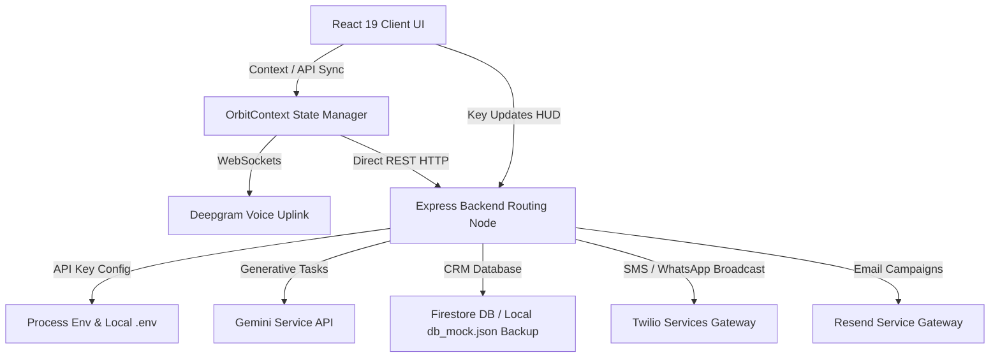

# ORBIT: Autonomous Growth Marketing Command Center
## System Design & Architectural Specification

This document details the system design, file mappings, data flow pipelines, and integration topologies of the **ORBIT** Autonomous Growth Marketing Command Center.

---

## 1. Architectural Overview

ORBIT is designed as a dynamic, real-time command center coordinating multi-agent generative marketing pipelines with analytics ledger synchronization, client credentials updates, and a voice-uplink telemetry interface.

The architecture is composed of three primary layers:
1. **Frontend App Shell & Interface**: Built on React 19 (TypeScript), Tailwind CSS 4, Framer Motion, and Lucide Icons. Orchestrated globally using [OrbitContext.tsx](file:///c:/Users/sachin/OneDrive/Desktop/ORBIT1/src/context/OrbitContext.tsx).
2. **Backend Services Node**: Built on Node.js/Express (TypeScript), managing API configurations, CRM sync, competitor analysis, simulation generation, and courtroom discussion loops.
3. **External Gateway Integrations**:
   - **AI Context**: Gemini API (`gemini-2.0-flash` on the client, `gemini-2.5-flash` / `gemini-3.1-flash-lite` on the server).
   - **Voice Node**: Deepgram WebSockets for low-latency voice-uplink.
   - **Dispatch Channels**: Twilio (WhatsApp/SMS) and Resend (Email).



---

## 2. Core Subsystems

### 2.1 Multi-Agent AI Orchestration
ORBIT assigns growth activities to five distinct AI Agent roles (configured in [geminiService.ts](file:///c:/Users/sachin/OneDrive/Desktop/ORBIT1/server/services/geminiService.ts)):
- **Polaris (Audience Intelligence)**: Segments cohorts (`Loyalists`, `Slipping Away`, `High-Value Inactive`, `New Signups`) to pinpoint high-potential targets.
- **Luna (Recovery Analysis)**: Scans for cart drop-offs, leakage points, and computes metrics (recoverable revenue, recovery confidence).
- **Vega (Predictive ROI)**: Generates quantitative revenue forecast models and confidence intervals.
- **Nova (Creative Campaign Copywriter)**: Compiles personalized messaging copy tailored per delivery channel.
- **Atlas (Operations / Dispatch Routing)**: Chooses optimal communication channels and validates the dispatch gateway routing parameters.

### 2.2 Neural Voice Uplink Drawer
Implemented inside [AppShell.tsx](file:///c:/Users/sachin/OneDrive/Desktop/ORBIT1/src/components/AppShell.tsx) and configured via [voiceAgentSettings.ts](file:///c:/Users/sachin/OneDrive/Desktop/ORBIT1/src/config/voiceAgentSettings.ts):
- Establishes connection directly to `wss://agent.deepgram.com/agent` using the HUD's configured Deepgram API key.
- Capture: Captures browser microphone input at 48000Hz (PCM linear16) and streams raw chunks.
- Playback: Streams returned chunk payloads gaplessly back using the HTML5 `AudioContext` at 24000Hz.
- Dialogue Log: Parses `ConversationText` payloads to render a scrollable transcript box in the voice drawer.

### 2.3 Resilient Firestore Failover Strategy
Orchestrated inside [firebase.ts](file:///c:/Users/sachin/OneDrive/Desktop/ORBIT1/server/config/firebase.ts) and consumer routes:
- If Firestore throws a `RESOURCE_EXHAUSTED` (gRPC status code 8) quota limits error, the backend prints warning logs, instantly flags the database connection, and reads from [db_mock.json](file:///c:/Users/sachin/OneDrive/Desktop/ORBIT1/db_mock.json) fallback.
- Avoids downtime during high-load demonstration sessions.

### 2.4 Live Credentials Sync & hot-reload
- Modifying credentials in the [PageHeaderHUD.tsx](file:///c:/Users/sachin/OneDrive/Desktop/ORBIT1/src/components/PageHeaderHUD.tsx) modal POSTs to [config.ts](file:///c:/Users/sachin/OneDrive/Desktop/ORBIT1/server/routes/config.ts).
- The backend writes the settings immediately to the local `.env` and processes variables in-memory, updating API services dynamically without requiring a server reboot.

---

## 3. Directory & File Reference

### 3.1 Client Pages (`src/pages/`)
Each page represents a separate tab panel in the dashboard system:
* [MissionControl.tsx](file:///c:/Users/sachin/OneDrive/Desktop/ORBIT1/src/pages/MissionControl.tsx) - Central operational command showing KPI cards, real-time agent execution visual pipelines, Luna Opportunity charts, and live agent log tracking.
* [CommandCenter.tsx](file:///c:/Users/sachin/OneDrive/Desktop/ORBIT1/src/pages/CommandCenter.tsx) - Custom manual setup interface to launch new growth objectives and execute campaign pipelines.
* [OrbitAnalytics.tsx](file:///c:/Users/sachin/OneDrive/Desktop/ORBIT1/src/pages/OrbitAnalytics.tsx) - Visual analytics interface depicting transactions, performance charts, and automated executive briefings generated by Gemini.
* [AgentBoardroom.tsx](file:///c:/Users/sachin/OneDrive/Desktop/ORBIT1/src/pages/AgentBoardroom.tsx) - Courtroom dashboard simulating collaborative agent debates to align on marketing actions.
* [CustomerGalaxy.tsx](file:///c:/Users/sachin/OneDrive/Desktop/ORBIT1/src/pages/CustomerGalaxy.tsx) - Interactive 2D scatter-plot canvas clustering customers based on metrics and segments.
* [OpportunityRadar.tsx](file:///c:/Users/sachin/OneDrive/Desktop/ORBIT1/src/pages/OpportunityRadar.tsx) - Multi-axis radar system mapping identified revenue leakage points.
* [CompetitorIntelligence.tsx](file:///c:/Users/sachin/OneDrive/Desktop/ORBIT1/src/pages/CompetitorIntelligence.tsx) - AI-driven competitor analysis dashboard reverse-engineering campaign strategies.
* [FutureSimulator.tsx](file:///c:/Users/sachin/OneDrive/Desktop/ORBIT1/src/pages/FutureSimulator.tsx) - Strategy simulation sandbox comparing Conservative, Recommended, and Aggressive marketing forecasts.
* [GrowthEngine.tsx](file:///c:/Users/sachin/OneDrive/Desktop/ORBIT1/src/pages/GrowthEngine.tsx) - Campaign scheduler management showing dispatch logs and delivery performance.
* [BusinessProfileSetup.tsx](file:///c:/Users/sachin/OneDrive/Desktop/ORBIT1/src/pages/BusinessProfileSetup.tsx) - Custom branding onboarding questionnaire (BusinessType, Tone, Values).
* [OrbitInitialization.tsx](file:///c:/Users/sachin/OneDrive/Desktop/ORBIT1/src/pages/OrbitInitialization.tsx) & [AuthFlow.tsx](file:///c:/Users/sachin/OneDrive/Desktop/ORBIT1/src/pages/AuthFlow.tsx) - Identity and system boot screens.
* [LandingPage.tsx](file:///c:/Users/sachin/OneDrive/Desktop/ORBIT1/src/pages/LandingPage.tsx) & [MissionSetup.tsx](file:///c:/Users/sachin/OneDrive/Desktop/ORBIT1/src/pages/MissionSetup.tsx) - Welcome panels.

### 3.2 Client Components (`src/components/`)
* [AppShell.tsx](file:///c:/Users/sachin/OneDrive/Desktop/ORBIT1/src/components/AppShell.tsx) - Layout container containing the sidebar navigation and sliding Neural Voice Link audio interface.
* [PageHeaderHUD.tsx](file:///c:/Users/sachin/OneDrive/Desktop/ORBIT1/src/components/PageHeaderHUD.tsx) - Heads-Up Display representing connection parameters, latency tracking, and configuration controls.
* [AgentCardModal.tsx](file:///c:/Users/sachin/OneDrive/Desktop/ORBIT1/src/components/AgentCardModal.tsx) - Deep-dive details on individual agent models and weights.
* [GuidedDemoModal.tsx](file:///c:/Users/sachin/OneDrive/Desktop/ORBIT1/src/components/GuidedDemoModal.tsx) - Interactive tutorial modal guiding first-time users.

### 3.3 Backend Routers (`server/routes/`)
Endpoints that coordinate backend queries:
* [autonomousMission.ts](file:///c:/Users/sachin/OneDrive/Desktop/ORBIT1/server/routes/autonomousMission.ts) - Manages missions execution status, history archive, duplication, and deletion.
* [boardroom.ts](file:///c:/Users/sachin/OneDrive/Desktop/ORBIT1/server/routes/boardroom.ts) - Simulates agent debates using live campaign contexts.
* [analytics.ts](file:///c:/Users/sachin/OneDrive/Desktop/ORBIT1/server/routes/analytics.ts) - Generates analytics digests and performance statistics.
* [competitorIntel.ts](file:///c:/Users/sachin/OneDrive/Desktop/ORBIT1/server/routes/competitorIntel.ts) - Aggregates reverse-engineered competitors data.
* [config.ts](file:///c:/Users/sachin/OneDrive/Desktop/ORBIT1/server/routes/config.ts) - Live write mechanism saving configuration attributes in `.env` settings.
* [customers.ts](file:///c:/Users/sachin/OneDrive/Desktop/ORBIT1/server/routes/customers.ts) / [orders.ts](file:///c:/Users/sachin/OneDrive/Desktop/ORBIT1/server/routes/orders.ts) / [campaigns.ts](file:///c:/Users/sachin/OneDrive/Desktop/ORBIT1/server/routes/campaigns.ts) - CRM data integrations with gRPC fallback logic.

---

## 4. Key Data Models & Types

### 4.1 Customer Segment Record
```typescript
interface Customer {
  id: string;
  name: string;
  email: string;
  phone: string;
  segment: "Loyalists" | "Slipping Away" | "High-Value Inactive" | "New Signups";
  ltv: number;
  churnRisk: number; // percentage
  churnTrend: "up" | "down" | "stable";
  purchaseCount: number;
  dna: string[];
  preferredChannel: "Email" | "WhatsApp" | "SMS" | "RCS";
  predictedNextPurchase: string;
  predictedCategory: string;
  avatar: string;
  x: number; // coordinates in 2D Galaxy Cluster
  y: number; 
}
```

### 4.2 Campaign Dispatch Record
```typescript
interface Campaign {
  id: string;
  name: string;
  goal: string;
  description: string;
  channel: "Email" | "WhatsApp" | "SMS" | "RCS";
  status: "Draft" | "Running" | "Completed" | "Queued" | "Sending" | "Delivered" | "Failed";
  sentCount: number;
  deliveredCount: number;
  openedCount: number;
  clickedCount: number;
  purchaseCount: number;
  revenueGenerated: number;
  createdAt: string;
  predictedRoi?: number;
  predictedRevenue?: number;
}
```

---

## 5. Development and Runtime Controls

### 5.1 Environment Variables
Create a root `.env` containing the following attributes:
```ini
PORT=3001
VITE_GEMINI_API_KEY=your_gemini_api_key
VITE_DEEPGRAM_API_KEY=your_deepgram_api_key
VITE_RESEND_API_KEY=your_resend_api_key
VITE_TWILIO_ACCOUNT_SID=your_twilio_sid
VITE_TWILIO_AUTH_TOKEN=your_twilio_token
VITE_TWILIO_PHONE_NUMBER=your_twilio_phone
```

### 5.2 Server Execution Scripts
Run backend and client commands inside their respective workspaces:
- Frontend: `npm run dev` (running default on port 5173).
- Backend Node: `npm run dev` or `ts-node-dev server/index.ts` (running on port 3001).
- Mock Database Seeding: `ts-node server/seed.ts` (populates fallback registers).
